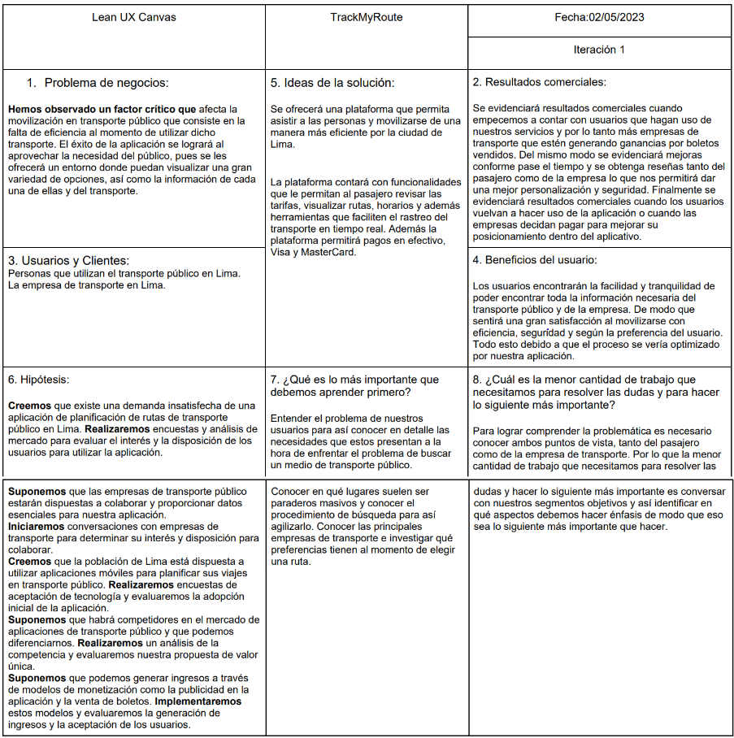

# TrackMyRoute

This project was generated with [Angular CLI](https://github.com/angular/angular-cli) version 17.3.3.

## Development server

Run `ng serve` for a dev server. Navigate to `http://localhost:4200/`. The application will automatically reload if you change any of the source files.

## Code scaffolding

Run `ng generate component component-name` to generate a new component. You can also use `ng generate directive|pipe|service|class|guard|interface|enum|module`.

## Build

Run `ng build` to build the project. The build artifacts will be stored in the `dist/` directory.

## Running unit tests

Run `ng test` to execute the unit tests via [Karma](https://karma-runner.github.io).

## Running end-to-end tests

Run `ng e2e` to execute the end-to-end tests via a platform of your choice. To use this command, you need to first add a package that implements end-to-end testing capabilities.

## Further help

To get more help on the Angular CLI use `ng help` or go check out the [Angular CLI Overview and Command Reference](https://angular.io/cli) page.

  

# Universidad Peruana de Ciencias Aplicadas

## Carrera de Ingeniería de Software

Ciclo: 2024 - 1

Curso: Desarrollo de Aplicaciones Open Source

Sección: WX54

Profesor: 

Startup:

Producto:

|           Integrantes            |   Código   |
| :------------------------------: | :--------: |
|     Nombre                       |            |
|    Nombre                        |            |
| Casimiro Fernandez, Carlos Oswaldo| U202115412 |
| Mancilla Ordaya, Eduardo Vicente | U202018894 |
|  Nombre                          |            |

# **Registro de Versiones**

<table>
  <thead>
    <tr>
        <th>Versión</th>
        <th>Descripción de modificación</th>
    </tr>
  </thead>
  <tbody>
  <tr>
      <td><strong>TB1</strong></td>
      <td>
        Se han incluído los siguientes capítulos:
        <ul>
          <li>Capítulo I: Introducción</li>
          <li>Capítulo II: Requirements Elicitation & Analysis</li>
          <li>Capítulo III: Requirements Specification</li>
          <li>Capítulo IV: Product Design</li>
          <li>Avance del Capítulo V: Product Implementation, Validation & Deployment hasta el punto 5.2.1.8</li>
          <li>Avance de Conclusiones, Bibliografía y Anexos</li>
        </ul>
      </td>
  </tr>
  </tbody>
</table>

# **Project Report Collaboration Insights**

URL Project Report (Github): 

# **Tabla de Contenido**

- [Registro de Versiones](#registro-de-versiones)
- [Project Report Collaboration Insights](#project-report-collaboration-insights)
- [Student Outcome](#student-outcome)
- [Capítulo I: Introducción](#Capítulo-I-Introducción)
  - [1.1. Startup Profile](#11-startup-profile)
    - [1.1.1. Descripción de la Startup](#111-descripción-de-la-startup)
   
    "TrackMyRoute" es una startup con la principal intención de transformar la forma en que las personas se desplazan por la ciudad utilizando el transporte público. Nuestra misión es simplificar y mejorar la movilidad urbana, ofreciendo a los residentes de Lima una aplicación integral que les permita encontrar las mejores rutas de transporte público para llegar a sus destinos de manera eficiente. Nuestra aplicación no solo brinda a los usuarios la capacidad de planificar sus viajes de manera óptima, sino que también proporciona información en tiempo real sobre el estado de las rutas y la disponibilidad de los medios de transporte. Además, colaboramos estrechamente con las empresas de transporte público para que también puedan beneficiarse de esta plataforma, obteniendo una visión en tiempo real de sus clientes y mejorando la calidad de sus servicios. 

    - [1.1.2. Perfiles de integrantes del equipo](#112-perfiles-de-integrantes-del-equipo)

    Carlos Oswaldo Casimiro: Tengo 18 años y soy estudiante de Ingeniería de Software de la Universidad Peruana de Ciencias Aplicadas. Me considero una persona proactiva, educada y sociable con los que me rodean. Además cuento con habilidades peculiares como la animación en 3d, edición de videos cinematográficos y conocimiento en lenguajes como c + +, Python.

    
    

  - [1.2. Solution Profile](#12-solution-profile)

  En esta sección iniciaremos por un análisis de los antecedentes y problemática sobre la movilización en transporte público para identificar las raíces del problema e identificar algunas necesidades que se deban cubrir para llegar a una solución de la problemática. Asimismo, luego pasaremos por el proceso UX para poder analizar más a detalle la problemática y poder plantear una hipótesis acerca de la problemática. 

    - [1.2.1. Antecedentes y problemática](#121-antecedentes-y-problemática)

    La movilización en transportes públicos en Lima, se ha visto influenciada por una serie de antecedentes y problemáticas a lo largo de su historia. En un contexto de rápido crecimiento poblacional y urbano, la demanda de servicios de transporte público ha ido en constante aumento. Sin embargo, varios factores han contribuido a desafiar la eficiencia y la calidad de la movilización en la ciudad. Históricamente, Lima contaba con sistemas de transporte público, como los tranvías, en el siglo XIX. Sin embargo, la falta de inversión y una planificación inadecuada llevaron al declive y eventual desaparición de estos sistemas en la segunda mitad del siglo XX. Entre las problemáticas más apremiantes se destaca la congestión del tráfico, que afecta de manera significativa a los limeños. El aumento de vehículos particulares y la infraestructura inadecuada han resultado en largos tiempos de viaje y congestión constante en las calles de la ciudad. Asimismo, el transporte público en Lima ha enfrentado dificultades, desde deficiencias en infraestructura y falta de mantenimiento hasta servicios ineficientes. Los usuarios a menudo se ven obligados a utilizar autobuses y combis en condiciones precarias, lo que afecta negativamente su experiencia de viaje. La seguridad en el transporte público también ha sido motivo de preocupación, con incidentes de robos y acoso a los pasajeros. Esto ha generado inquietudes sobre la seguridad de los usuarios en el sistema. Además, las tarifas de transporte público pueden resultar onerosas para personas de bajos ingresos, y la falta de accesibilidad adecuada para personas con discapacidad ha sido una preocupación persistente. A pesar de estos desafíos, el gobierno y las autoridades locales han implementado medidas para mejorar el transporte público en Lima, incluyendo la introducción de sistemas de transporte masivo como el Metropolitano y el Tren Eléctrico, así como esfuerzos para combatir la informalidad y elevar la calidad del servicio. Sin embargo, los retos siguen siendo considerables en una ciudad en constante crecimiento y transformación.

¿Qué?: La movilización en transportes públicos en Lima se refiere al desplazamiento de personas dentro de la ciudad utilizando medios de transporte público, como autobuses, combis, el Metropolitano (un sistema de buses de tránsito rápido) y el Tren Eléctrico. Esto incluye viajes diarios para trabajar, estudiar y realizar actividades cotidianas.
 
¿Quién?: Los usuarios del transporte público en Lima, que incluyen a residentes locales y visitantes de la ciudad, son los principales actores de esta movilización. Además, las autoridades gubernamentales y las empresas de transporte público desempeñan un papel importante en la gestión y regulación de estos servicios. 

¿Por qué?: Las personas utilizan el transporte público en Lima por varias razones, incluyendo la congestión del tráfico, la falta de estacionamiento, la necesidad de una opción de movilidad asequible y la preocupación por el medio ambiente. Además, muchas personas no tienen acceso a un automóvil personal y dependen del transporte público para sus desplazamientos diarios. 

¿Dónde?: Esta movilización se lleva a cabo en toda la ciudad de Lima, que incluye el centro histórico, los distritos periféricos y las áreas metropolitanas circundantes. Los usuarios se desplazan tanto dentro de la ciudad como hacia y desde los suburbios. 

¿Cuándo?: La movilización en transportes públicos en Lima ocurre todos los días, durante todas las horas del día, ya que es esencial para las actividades diarias de la población. Los horarios varían según la ruta y el tipo de transporte. 

¿Cómo?: Los usuarios pueden acceder al transporte público en Lima a través de una red de paraderos y estaciones que sirven a diferentes rutas y servicios. Los sistemas de transporte masivo, como el Metropolitano y el Tren Eléctrico, ofrecen tarjetas de acceso y estaciones específicas para abordar. Los autobuses y combis tienen paraderos designados en las calles 

¿Cuánto?: El costo de utilizar el transporte público en Lima varía según el tipo de servicio y la distancia recorrida. Los precios de los boletos pueden oscilar desde unos pocos centavos hasta varios soles peruanos, dependiendo de la ruta y el sistema de transporte. Los usuarios a menudo pueden optar por tarifas con descuento si utilizan tarjetas de prepago o si son estudiantes o adultos mayores. 

Conclusiones de las 5W y 2H: En conclusión, la movilización en transportes públicos en Lima, Perú, es una parte fundamental de la vida cotidiana de sus residentes y visitantes. Este sistema de transporte es utilizado por una amplia variedad de personas que dependen de él para desplazarse por la ciudad debido a la congestión del tráfico, la falta de estacionamiento y la necesidad de opciones de movilidad asequibles. A pesar de las numerosas problemáticas, como la congestión, la seguridad y la falta de inversión en infraestructura, el transporte público sigue siendo esencial para mantener la movilidad en una ciudad en constante crecimiento y transformación. Los esfuerzos de las autoridades locales y gubernamentales, como la implementación de sistemas de transporte masivo y la regulación del sector, son pasos importantes hacia la mejora de la movilización en Lima.

  - [1.2.2. Lean UX Process](#122-lean-ux-process)
      - [1.2.2.1. Lean UX Problem Statements](#1221-lean-ux-problem-statements)

      El propósito de TrackMyRoute es ayudar a las personas a planificar y realizar viajes en transporte público de manera fácil y eficiente. Además, de reducir los costos de transporte y la congestión de tráfico. Esto contribuye a mejorar la calidad del aire para reducir el impacto ambiental de los desplazamientos diarios.

      - [1.2.2.2. Lean UX Assumptions](#1222-lean-ux-assumptions)

      User Assumptions 

I. ¿Quién es el usuario? TrackMyRoute está dirigido a cualquier persona que utilice el transporte público en la ciudad de Lima. Esto puede incluir a estudiantes, trabajadores, viajeros y cualquier otra persona que necesite planificar un viaje en transporte público. Además es útil para turistas y visitantes que no están familiarizados con el sistema de transporte público local y que necesitan ayuda para planificar sus viajes.

II. ¿Dónde encaja nuestro producto en su trabajo o vida? 

Nuestro servicio encaja para los residentes de Lima, que dependen en gran medida del transporte público para sus desplazamientos diarios, "TrackMyRoute" puede ser una herramienta esencial. Les permite encontrar la mejor ruta de transporte público para llegar a su destino de manera eficiente, ahorrando tiempo y minimizando la incertidumbre en sus viajes. Esto se traduce en una mayor comodidad y productividad en su vida cotidiana.

III. ¿Qué problemas tiene nuestro producto? ¿Evitar? 

La precisión de la información en tiempo real es fundamental para la efectividad de la aplicación. Los datos incorrectos pueden llevar a los usuarios por rutas equivocadas y generar frustración. Además, al recopilar datos de ubicación en tiempo real, es crucial garantizar la privacidad y seguridad de los usuarios. Es por ello que debemos evitar problemas de seguridad, como la exposición de datos sensibles o la posibilidad de rastreo no autorizado.

IV. ¿Cuándo y cómo es nuestro producto? ¿Usado? 

Nuestro servicio podrá ser utilizado a través de dispositivos móviles, como teléfonos inteligentes o tabletas. Los usuarios pueden descargar la aplicación desde tiendas de aplicaciones móviles, como la App Store o Google Play, e instalarla en sus dispositivos. Luego, ingresan su ubicación actual y destino, y la aplicación proporciona información sobre las rutas disponibles, tiempos de viaje estimados y actualizaciones en tiempo real sobre la ubicación de los vehículos de transporte público. Esto permite a los usuarios tomar decisiones informadas sobre la mejor manera de llegar a su destino utilizando el transporte público en Lima. 

V. ¿Qué características son importantes? 

“TrackMyRoute" es una aplicación esencial para los usuarios de transporte público en Lima, ofreciendo una amplia gama de características cruciales, como la búsqueda de rutas, información en tiempo real sobre el transporte, notificaciones y alertas, mapas interactivos, detalles de tarifas y opciones de pago, comentarios de usuarios, historial de viajes, accesibilidad y medidas de seguridad, todo ello respaldado por una colaboración efectiva con las empresas de transporte. Esta aplicación mejora la experiencia de viaje al ayudar a los usuarios a planificar y seguir sus rutas de manera eficiente, brindando un servicio completo y personalizado que facilita la movilidad en la ciudad de Lima. 

VI. ¿Cómo debe verse nuestro producto y cómo comportarse? 

Nuestra plataforma tiene que interactuar con los usuarios mediante un diseño llamativo e intuitivo con la finalidad de que nuestros usuarios confíen en nosotros y tengan facilidad de lograr sus objetivos al usar la plataforma. 

Business Assumptions 

1. Demanda de Usuarios: Suponemos que existe una demanda significativa de una aplicación de planificación de rutas de transporte público en Lima, ya que muchas personas utilizan el transporte público en la ciudad y buscan formas de optimizar sus viajes. 
2. Colaboración con Empresas de Transporte: Suponemos que las empresas de transporte público en Lima estarán dispuestas a colaborar y proporcionar datos actualizados sobre sus rutas y vehículos para integrarlos en nuestra aplicación. 

3. Disponibilidad de Datos en Tiempo Real: Suponemos que podemos acceder a datos en tiempo real de los sistemas de transporte público, lo que nos permitirá proporcionar información precisa sobre la ubicación y el estado de los vehículos. 

4. Aceptación de Tecnología: Suponemos que la población de Lima está dispuesta a adoptar y utilizar aplicaciones móviles para planificar sus viajes en transporte público, y que cuentan con los dispositivos y la conectividad necesarios. 

5. Monetización: Suponemos que podemos generar ingresos a través de modelos de monetización como la publicidad en la aplicación, la venta de boletos de transporte o la suscripción premium para características adicionales. 

6. Seguridad de Datos: Suponemos que podemos garantizar la seguridad y privacidad de los datos personales de los usuarios, lo que fomentará la confianza en nuestra aplicación. 

7. Competencia: Suponemos que habrá competidores en el mercado de aplicaciones de transporte público en Lima, y debemos encontrar formas de diferenciarnos y ofrecer un valor único a los usuarios. 

8. Retención de Usuarios: Suponemos que podemos mantener una base de usuarios activa y comprometida a largo plazo mediante actualizaciones regulares de la aplicación, características adicionales y un excelente servicio al cliente. 

9. Regulaciones y Cumplimiento Normativo: Suponemos que podemos cumplir con todas las regulaciones y requisitos legales relacionados con la operación de una aplicación de transporte público en Lima. 

10. Marketing efectivo: Suponemos que podemos llevar a cabo estrategias de marketing efectivas para aumentar la conciencia y la adopción de la aplicación entre los residentes y visitantes de Lima.

      - [1.2.2.3. Lean UX Hypothesis Statements](#1223-lean-ux-hypothesis-statements)

      Creemos que existe una demanda insatisfecha de una aplicación de planificación de rutas de transporte público en Lima. 
Realizaremos encuestas y análisis de mercado para evaluar el interés y la disposición de los usuarios para utilizar la aplicación. 
Suponemos que las empresas de transporte público estarán dispuestas a colaborar y proporcionar datos esenciales para nuestra aplicación. 
Iniciaremos conversaciones con empresas de transporte para determinar su interés y disposición para colaborar.
Creemos que la población de Lima está dispuesta a utilizar aplicaciones móviles para planificar sus viajes en transporte público. 
Realizaremos encuestas de aceptación de tecnología y evaluaremos la adopción inicial de la aplicación. 
Suponemos que habrá competidores en el mercado de aplicaciones de transporte público y que podemos diferenciarnos. 
Realizaremos un análisis de la competencia y evaluaremos nuestra propuesta de valor única. 
Suponemos que podemos generar ingresos a través de modelos de monetización como la publicidad en la aplicación y la venta de boletos. 
Implementaremos estos modelos y evaluaremos la generación de ingresos y la aceptación de los usuarios.
      
      - [1.2.2.4. Lean UX Canvas](#1224-lean-ux-canvas)

  - [1.3. Segmentos objetivo](#13-segmentos-objetivo)

Segmento objetivo 1: Pasajeros en busca de un autobús. (Pasajeros) 

• Personas que viajan al trabajo o la escuela en transporte público. 

• Turistas que exploran Lima y prefieren utilizar el transporte público. 

• Personas que no tienen acceso a un vehículo personal y dependen del transporte público para sus desplazamientos diarios. 

Segmento objetivo 2: Empresas de transporte que operan en Lima. 

• Los gerentes de operaciones y logística de estas empresas. 

• Empresas formalizadas y con papeles en regla.

- [Capítulo II: Requirements Elicitation & Analysis](#Capítulo-II-Requirements-Elicitation--Analysis)
  - [2.1. Competidores](#21-competidores)
    - [2.1.1. Análisis competitivo](#211-análisis-competitivo)
    - [2.1.2. Estrategias y tácticas frente a competidores](#212-estrategias-y-tácticas-frente-a-competidores)
  - [2.2. Entrevistas](#22-entrevistas)
    - [2.2.1. Diseño de entrevistas](#221-diseño-de-entrevistas)
    - [2.2.2. Registro de entrevistas](#222-registro-de-entrevistas)
    - [2.2.3. Análisis de entrevistas](#223-análisis-de-entrevistas)
  - [2.3. Needfinding](#23-needfinding)
    - [2.3.1. User Personas](#231-user-personas)
    - [2.3.2. User Task Matrix](#232-user-task-matrix)
    - [2.3.3. User Journey Mapping](#233-user-journey-mapping)
    - [2.3.4. Empathy Mapping](#234-empathy-mapping)
    - [2.3.5. As-is Scenario Mapping](#235-as-is-scenario-mapping)
  - [2.4. Ubiquitous Language](#23-ubiquitous-language)
- [Capítulo III: Requirements Specification](#Capítulo-III-Requirements-Specification)
  - [3.1. To-Be Scenario Mapping](#31-to-be-scenario-mapping)
  - [3.2. User Stories](#32-user-stories)
  - [3.3. Impact Mapping](#33-impact-mapping)
  - [3.4. Product Backlog](#34-product-backlog)
- [Capítulo IV: Product Design](#Capítulo-IV-Product-Design)
  - [4.1. Style Guidelines](#41-style-guidelines)
    - [4.1.1. General Style Guidelines](#411-general-style-guidelines)
    - [4.1.2. Web Style Guidelines](#412-web-style-guidelines)
  - [4.2. Information Architecture](#42-information-architecture)
    - [4.2.1. Organization Systems](#421-organization-systems)
    - [4.2.2. Labeling Systems](#422-labeling-systems)
    - [4.2.3. SEO Tags and Meta Tags](#423-seo-tags-and-meta-tags)
    - [4.2.4. Searching Systems](#424-searching-systems)
    - [4.2.5. Navigation Systems](#425-navigation-systems)
  - [4.3. Landing Page UI Design](#43-landing-page-ui-design)
    - [4.3.1. Landing Page Wireframe](#431-landing-page-wireframe)
    - [4.3.2. Landing Page Mock-up](#432-landing-page-mock-up)
  - [4.4. Web Applications UX/UI Design](#44-web-applications-uxui-design)
    - [4.4.1. Web Applications Wireframes](#441-web-applications-wireframes)
    - [4.4.2. Web Applications Wireflow Diagrams](#442-web-applications-wireflow-diagrams)
    - [4.4.3. Web Applications Mock-ups](#443-web-applications-mock-ups)
    - [4.4.4. Web Applications User Flow Diagrams](#444-web-applications-user-flow-diagrams)
  - [4.5. Web Applications Prototyping](#45-web-applications-prototyping)
  - [4.6. Domain-Driven Software Architecture](#46-domain-driven-software-architecture)
    - [4.6.1. Software Architecture Context Diagram](#461-software-architecture-context-diagram)
    - [4.6.2. Software Architecture Container Diagrams](#462-software-architecture-container-diagrams)
    - [4.6.3. Software Architecture Components Diagrams](#463-software-architecture-components-diagrams)
  - [4.7. Software Object-Oriented Design](#47-software-object-oriented-design)
    - [4.7.1. Class Diagrams](#471-class-diagrams)
    - [4.7.2. Class Dictionary](#472-class-dictionary)
  - [4.8. Database Design](#48-database-design)
    - [4.8.1. Database Diagram](#481-database-diagram)
- [Capítulo V: Product Implementation, Validation & Deployment](#Capítulo-V-Product-Implementation-Validation--Deployment)
  - [5.1. Software Configuration Management](#51-software-configuration-management)
    - [5.1.1. Software Development Environment Configuration](#511-software-development-environment-configuration)
    - [5.1.2. Source Code Management](#512-source-code-management)
    - [5.1.3. Source Code Style Guide & Conventions](#513-source-code-style-guide--conventions)
    - [5.1.4. Software Deployment Configuration](#514-software-deployment-configuration)
  - [5.2. Landing Page, Services & Applications Implementation](#52-landing-page-services--applications-implementation)
    - [5.2.1. Sprint n](#521-sprint-n)
      - [5.2.1.1. Sprint Planning n](#5211-sprint-planning-n)
      - [5.2.1.2. Sprint Backlog n](#5212-sprint-backlog-n)
      - [5.2.1.3. Development Evidence for Sprint Review](#5213-development-evidence-for-sprint-review)
      - [5.2.1.4. Testing Suite Evidence for Sprint Review](#5214-testing-suite-evidence-for-sprint-review)
      - [5.2.1.5. Execution Evidence for Sprint Review](#5215-execution-evidence-for-sprint-review)
      - [5.2.1.6. Services Documentation Evidence for Sprint Review](#5216-services-documentation-evidence-for-sprint-review)
      - [5.2.1.7. Software Deployment Evidence for Sprint Review](#5217-software-deployment-evidence-for-sprint-review)
      - [5.2.1.8. Team Collaboration Insights during Sprint](#5218-team-collaboration-insights-during-sprint)
- [Conclusiones](#conclusiones)
  - [Conclusiones y recomendaciones](#conclusiones-y-recomendaciones)
- [Video About-the-Team](#video-about-the-team)
- [Bibliografía](#bibliografía)
- [Anexos](#anexos)

# **Capítulo I: Introducción**

  1.1  Startup Profile.
   
En esta sección se presenta la descripción del startup y los perfiles de los miembros del equipo.

   **1.1.1. Descripción del startup.**
